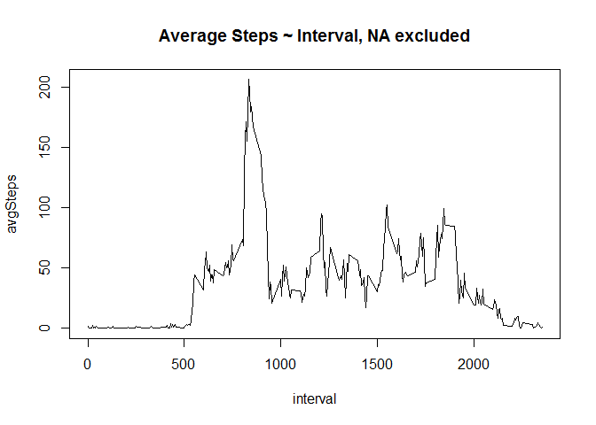

# Reproducible Research: Peer Assessment 1

## Loading and preprocessing the data

```r
library(knitr)
```

```
## Warning: package 'knitr' was built under R version 3.1.3
```

```r
setwd("~/GitHub/RepData_PeerAssessment1")
getNumberOfDays<-function(myData){
    myData$date<-as.character(myData$date)
    nDays<-1
    n<-nrow(myData)
    myDay<-myData$date[1]
    for(i in 1:n){
        newDay<-myData$date[i]
        if(newDay != myDay){
            nDays<-nDays+1
            myDay<-newDay
        }
    }
    nDays
}
```
1. Read the acvity data.


```r
data <- read.csv("data/activity.csv")
```
2. For this part of the assignment, ignore the missing values in the dataset.


```r
data.noNA <- na.omit(data)
```

## What is mean total number of steps taken per day?
1. Calculate the total number of steps taken per day and plot  a histogram of the total number of steps taken each day.


```r
stepsPerDay<-aggregate(steps ~ date, sum, data = data.noNA)
with(stepsPerDay,hist(steps,breaks=15,main="Total Steps per Day, NA excluded",col="red",labels=FALSE))
```

 

2. Calculate and report the mean and median of the total number of steps taken per day.


```r
mean.noNA<-mean(stepsPerDay$steps)
print(c("Mean of Total Number of Steps per Day Ignore NA = ",mean.noNA),quote=FALSE)
```

```
## [1] Mean of Total Number of Steps per Day Ignore NA = 
## [2] 10766.1886792453
```
 

```r
median.noNA<-median(stepsPerDay$steps)
print(c("Median of Total Number of Steps per Day Ignore NA = ",median.noNA),quote=FALSE)
```

```
## [1] Median of Total Number of Steps per Day Ignore NA = 
## [2] 10765
```

## What is the average daily activity pattern?
1. Make a time series plot of the 5-minute interval (x-axis) and the average number of steps taken, averaged across all days (y-axis)


```r
avgStepsPerInt<-aggregate(steps ~ interval, sum, data = data.noNA)
nInt<-nrow(data.noNA)/nrow(avgStepsPerInt)
avgStepsPerInt$avgSteps<-avgStepsPerInt$steps/nInt
with(avgStepsPerInt,plot(avgSteps ~ interval,type="l",main="Average Steps ~ Interval, NA excluded"))
```

 

2. Which 5-minute interval, on average across all the days in the dataset, contains the maximum number of steps?

```r
avgStepsPerInt[avgStepsPerInt$avgSteps==max(avgStepsPerInt$avgSteps),]
```

```
##     interval steps avgSteps
## 104      835 10927 206.1698
```

## Imputing missing values
1. Calculate and report the total number of missing values in the dataset.

```r
sum(is.na(data$steps))
```

```
## [1] 2304
```
2. Devise a strategy for filling in all of the missing values in the dataset. The strategy does not need to be sophisticated. For example, you could use the mean/median for that day, or the mean for that 5-minute interval, etc.

    I will replace the NA by the mean for the 5-minute interval.

3. Create a new dataset that is equal to the original dataset but with the missing data filled in.

```r
replaceNA<-function(myData){
    n<-nrow(myData)
    for(i in 1:n)
        if(is.na(myData$steps[i])){
            myInterval<-myData$interval[i]
            myValue<-avgStepsPerInt[avgStepsPerInt$interval==myInterval,3]
            myData$steps[i]<-myValue
        }
    myData
}
newData<-replaceNA(data)
```

4. Make a histogram of the total number of steps taken each day and Calculate and report the mean and median total number of steps taken per day. Do these values differ from the estimates from the first part of the assignment? What is the impact of imputing missing data on the estimates of the total daily number of steps?

```r
newStepsPerDay<-aggregate(steps ~ date, sum, data = newData)
with(newStepsPerDay,hist(steps,col="blue",breaks=15,main="Total Steps Each Day, NA replaced",labels=FALSE))
```

 

```r
mean.addData<-mean(newStepsPerDay$steps)
print(c("Mean of Total Number of Steps per Day with NA Replaced = ",mean.addData),quote=FALSE)
```

```
## [1] Mean of Total Number of Steps per Day with NA Replaced = 
## [2] 10766.1886792453
```

```r
median.addData<-median(newStepsPerDay$steps)
print(c("Median of Total Number of Steps per Day with NA Replaced = ",median.addData),quote=FALSE)
```

```
## [1] Median of Total Number of Steps per Day with NA Replaced = 
## [2] 10766.1886792453
```

The impact of imputing missing data includes the following.

* Histogram values changed with the highest value increasing significantly.

```r
par(mfrow = c(1, 2), mar = c(5, 4, 2, 1))
with(stepsPerDay,hist(steps,breaks=15,main="Total Steps per Day, NA excluded",col="red",labels=FALSE,ylim=c(0,25)))
with(newStepsPerDay,hist(steps,col="blue",breaks=15,main="Total Steps per Day, NA replaced",labels=FALSE,ylim=c(0,25)))
```

 

```r
par(mfrow = c(1, 1))
```

* Although the mean did not change, the median was changed to agree with the mean and is no longer an integer.

```
## [1] Means, noNA and addData =  10766.1886792453          
## [3] 10766.1886792453
```

```
## [1] Medians, noNA and addData =  10765                       
## [3] 10766.1886792453
```


## Are there differences in activity patterns between weekdays and weekends?
Use the dataset with the filled-in missing values for this part.

1. Create a new factor variable in the dataset with two levels - "weekday" and "weekend" indicating whether a given date is a weekday or weekend day.

```r
getWeekorWeekend<-function(myDate){
    myDay<-weekdays(as.POSIXlt(myDate))
    if(myDay=="Saturday" || myDay=="Sunday") return("weekend")
    else return("weekday")
}
getWeekdayID<-function(myData){
    n<-nrow(myData)
    myDay<-getWeekorWeekend(myData[1,1])
    myList<-c(myDay)
    for(i in 2:n){
        myDay<-getWeekorWeekend(myData[i,1])
        myList<-c(myList,myDay)
    }
    return(myList)
}
x<-getWeekdayID(newStepsPerDay)
newDataPlus<-newData
newDataPlus$weekday<-as.factor(x)
```
2. Make a panel plot containing a time series plot (i.e. type = "l") of the 5-minute interval (x-axis) and the average number of steps taken, averaged across all weekday days or weekend days (y-axis). 

```r
library(lattice)
sumDataByFactor<-aggregate(steps ~ interval+weekday, sum, data = newDataPlus)
avgDataByFactor<-sumDataByFactor
nDays<-getNumberOfDays(newDataPlus)
avgDataByFactor$avgSteps<-avgDataByFactor$steps/nDays
xyplot(steps ~ interval | weekday, data = avgDataByFactor, layout = c(1, 2),type="l",ylab="avg steps")
```

 
